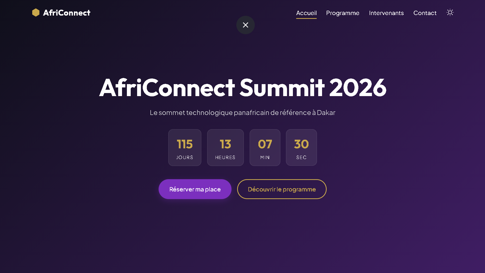
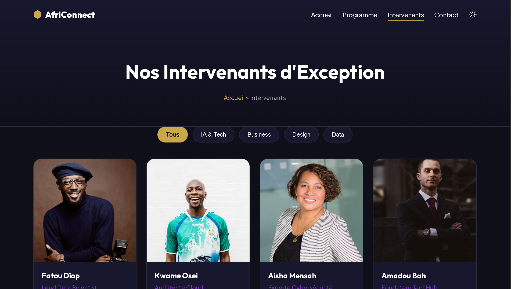
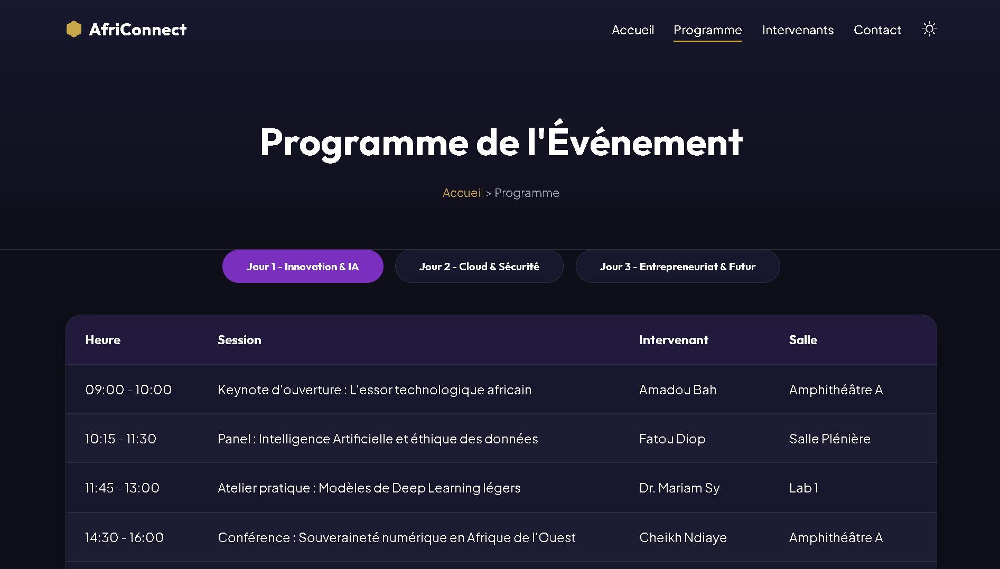
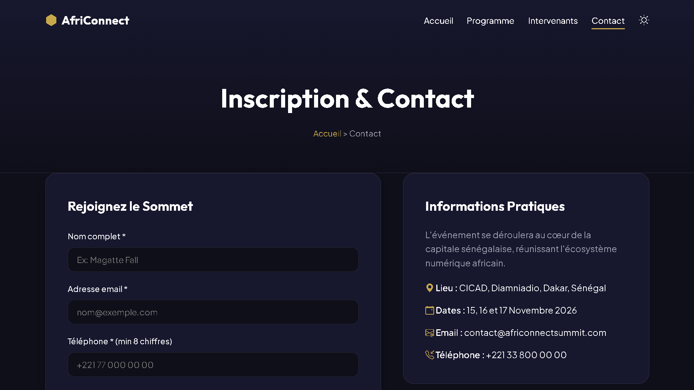

AfriConnectSummit 

AfriConnectSummit est un site web vitrine pour un sommet technologique fictif organisé à Dakar, Sénégal.  
Il présente l'événement, le programme, les speakers, les tickets et les contenus médias, avec une identité visuelle moderne inspirée des grands sommets tech africains.

---

Objectifs du projet

- Proposer une plateforme claire et professionnelle pour un summit tech.
- Mettre en avant les talents, startups, investisseurs et entreprises africaines.
- Faciliter la découverte du programme et des différentes offres de tickets.
- Centraliser les contenus médias (replays, articles, podcasts) liés à l'événement.
- Servir de projet pédagogique pour la maîtrise de HTML, CSS, Bootstrap et JavaScript.

---

Fonctionnalités principales

1. Page d’accueil avec hero 

- Overlay bleu nuit transparent pour garantir un contraste suffisant avec le texte.
- Titre principal : « Où la tech africaine se connecte ».
- Affichage des informations clés : dates du summit, lieu (Dakar, Sénégal).
- Boutons d’action (CTA) :
  - **Réserver mon pass** → section Tickets.
  - **Voir les contenus** → section Media.

 2. Section intervenants

- Cartes pour chaque speaker avec :
  - Photo (image de couverture).
  - Nom, rôle, organisation.
  - Bio courte centrée sur la tech / l’entrepreneuriat.
  - Tags thématiques (Fintech, AI, SaaS, Investissement…).
- Mise en page en grille responsive.
- Possibilité d’étendre vers une page dédiée listant tous les speakers.

 3. Section  Programme

 

- Programme détaillé sur deux jours :
  - Jour 1 : Ecosystème & opportunités.
  - Jour 2 : Talent & skills.
- Listes horaires avec colonnes :
  - Heure de début.
  - Titre de la session (Keynote, Panel, Masterclass, Labs…).
- Trois tracks thématiques :
  - Startup & investment.
  - Talent & skills.
  - Corporate innovation.

 

 6. Section « Contact »

- Formulaire de contact :
  - Nom complet.
  - Adresse email.
  - Sujet.
  - Message.
- Bloc « Infos pratiques » :
  - Lieu.
  - Dates.
  - Adresses email de contact (général, partenariat).
- Liens vers les réseaux sociaux (LinkedIn, Twitter/X, Instagram).

 7. Navigation & expérience utilisateur

- Navbar fixe en haut de page avec :
  - Accueil.
  - Intervenants
  - Programme. 
  - Contact.
- Scroll fluide (smooth scroll) vers les sections au clic sur les liens.
- Effet visuel sur la navbar lors du scroll (background renforcé + ombre).
- Site entièrement responsive (desktop, tablette, mobile).

---

Stack technique

- HTML5 : structure des pages et sections.
- CSS3: styles personnalisés, palette de couleurs, animations légères.
- Bootstrap 5.3 : grille responsive, composants (navbar, boutons, formulaires).
- JavaScript vanilla :
  - Smooth scroll vers les ancres.
  - Effet de navbar au scroll.
  - Base pour ajouter d’autres interactions (compteurs, animations…).

- Google Fonts 

Auteur

- Nom : Magatte Fall  
- Établissement : ISI Dakar  
 AfriConnectSummit – site vitrine de sommet technologique

lien github pages: https://msfvenom-0.github.io/Fall-Magatte-AfriConnectSummit/